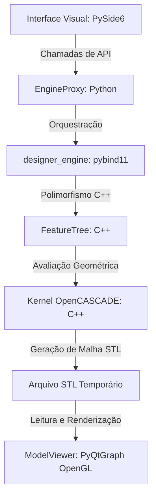

# Arquitetura do Sistema 3Designer

Este documento descreve a arquitetura técnica e o fluxo de dados do **3Designer**, detalhando a cooperação entre o motor geométrico em C++ (OpenCASCADE), a ponte de vinculação dinâmica (pybind11) e a interface gráfica em Python (PySide6 / PyQtGraph).

---

## 1. Visão Geral da Arquitetura

O projeto adota uma arquitetura desacoplada em três camadas principais:

1. **Camada de Negócio e Kernel CAD (C++)**: Escrita em C++17, consome diretamente a API do **OpenCASCADE (OCCT)** para realizar cálculos matemáticos pesados de modelagem sólida (extrusão, revolução, fillet, chamfer e operações booleanas).
2. **Ponte de Vinculação (pybind11)**: Compilada como um módulo nativo compartilhado do Python (`designer_engine.so`), ela expõe classes, estruturas, enums e métodos C++ de forma transparente e performática.
3. **Camada de Apresentação (Python)**:
   - **`EngineProxy`**: Camada intermediária (wrapper) que abstrai os bindings e fornece assinaturas amigáveis baseadas em coleções e tipos nativos do Python.
   - **`ModelViewer`**: Componente OpenGL que lê malhas STL e as exibe usando sombreadores tridimensionais.
   - **`CADApp`**: A janela principal feita com PySide6 (Qt) que hospeda os controles de usuário e o visualizador 3D.

---

## 2. Componentes Técnicos do Motor C++

### 2.1. Representação Paramétrica (`Feature` e `FeatureTree`)
Toda a modelagem é orientada a recursos (*feature-based*). A classe base abstrata `Feature` é herdada por operações específicas:
- `SketchFeature`: Esboço 2D posicionado em um `WorkPlane`.
- `ExtrudeFeature` / `RevolveFeature`: Extrusores 3D com operações booleanas.
- `FilletFeature` / `ChamferFeature`: Modificações de arestas existentes de um sólido pai.

A `FeatureTree` gerencia o histórico de modelagem em uma lista linear (`std::vector<std::shared_ptr<Feature>>`). Quando `Rebuild()` é chamado:
1. O motor limpa o sólido ativo atual.
2. Varre o vetor sequencialmente configurando os pais corretos de cada operação.
3. Executa `Evaluate()` para cada nó. Se for bem sucedido, atualiza o sólido ativo global (`m_activeShape`).

### 2.2. Robustez e Rollbacks Atômicos
Durante as operações de modificação (como Fillet ou Chamfer), parâmetros geométricos inadequados (ex: raio de arredondamento maior que o comprimento da aresta) podem invalidar a peça. 
Para mitigar isso:
- Após gerar a geometria no OpenCASCADE, chamamos o `BRepCheck_Analyzer` sobre o sólido.
- Se o sólido for considerado inválido (`analyzer.IsValid() == false`), ou se o OpenCASCADE lançar um erro interno (`Standard_Failure`), o motor aborta a execução e lança uma exceção `std::runtime_error`.
- A `FeatureTree::Rebuild()` captura essa exceção, descarta a operação problemática que foi adicionada por último, restaura o sólido ativo para o estado anterior estável e informa a falha para a interface gráfica. **Nenhuma alteração corrompe o modelo permanentemente.**

---

## 3. A Ponte pybind11 e Gerenciamento de Memória

A ponte é definida no arquivo `src/bindings.cpp`. Ela realiza:
- **Mapeamento de Tipos**: Converte tipos do OpenCASCADE como `gp_Pnt2d` e coleções STL C++ (`std::vector`) em objetos nativos Python por meio de `#include <pybind11/stl.h>`.
- **Gerenciamento de Tempo de Vida**: Declara o suporte a ponteiros inteligentes usando `py::class_<Feature, std::shared_ptr<Feature>>`. Isso garante que o Python e o C++ compartilhem com segurança a propriedade dos objetos da árvore de features, prevenindo memory leaks ou acessos a ponteiros inválidos.
- **Polimorfismo Automático**: O pybind11 identifica as subclasses herdadas de `Feature`. Assim, quando o Python recupera itens da árvore de features através de `GetFeatures()`, o interpretador sabe instantaneamente se o objeto é um `SketchFeature` ou um `ExtrudeFeature` usando herança dinâmica do C++.

---

## 4. Fluxo de Dados de uma Operação (Exemplo: Aplicar Fillet)

O ciclo de vida de uma operação acionada pela GUI segue a sequência abaixo:

1. **Entrada do Usuário**: O usuário digita o ID da aresta (ex: `1`), o Raio (ex: `1.5`) no painel esquerdo e clica em "Aplicar Fillet".
2. **Registro de Feature**: A classe `CADApp` chama o método `self.proxy.add_fillet("Fillet1", 1, 1.5)`.
3. **Instanciação C++**: O `EngineProxy` instancia a classe C++ `FilletFeature` e a insere na `FeatureTree`.
4. **Fase de Rebuild**:
   - `tree.Rebuild()` é disparada.
   - O motor executa `Evaluate()` na nova `FilletFeature`.
   - `BRepFilletAPI_MakeFillet` é instanciado em C++, busca a aresta 1 no sólido anterior, calcula a superfície cilíndrica e costura o sólido resultante.
   - A topologia é checada com `BRepCheck_Analyzer`. Se for válida, o sólido ativo do motor é atualizado.
5. **Exportação STL**: Em caso de sucesso no rebuild, a interface chama `self.proxy.export_to_stl("temp_view.stl")`. O C++ triangula a malha via `BRepMesh_IncrementalMesh` e grava os dados em formato binário.
6. **Atualização da View**: O widget `ModelViewer` lê os triângulos do arquivo `temp_view.stl` de forma binária ultrarrápida usando `numpy` e renderiza a nova geometria na tela através de sombreadores OpenGL (shaders de normais de faces).
